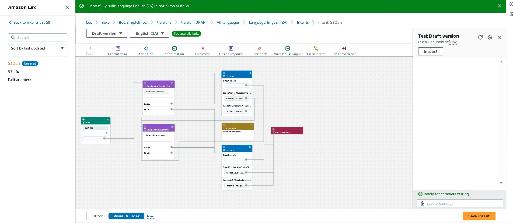
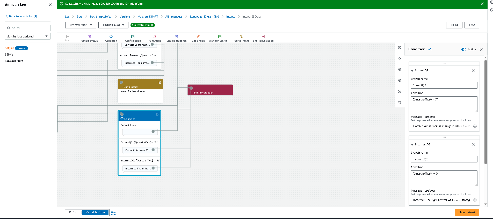
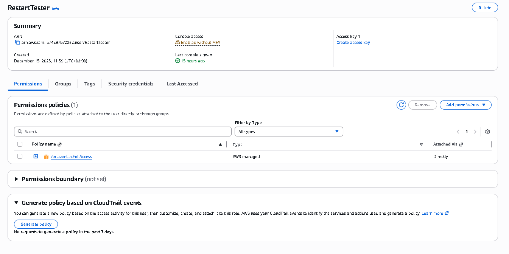

# Project 3: AI-Powered Assessment Bot ('S3Quiz')

## Project Overview
I designed and deployed a conversational interface using **Amazon Lex V2** to create an interactive technical assessment. The bot, named "S3Quiz," tests users on their knowledge of AWS Storage services. The project demonstrates my ability to implement Natural Language Processing (NLP) solutions, configure complex logic flows, and manage secure access controls via **AWS IAM**.

---

## Technical Architecture & Stack
* **Service:** Amazon Lex V2
* **Security:** AWS IAM (Identity & Access Management)
* **Logic:** Conditional Branching & Response Routing
* **Data Handling:** Slots, Custom Types, and Session Attributes

---

## Technical Implementation Steps

### 1. Intent & Conversation Design
I initialized the **`S3Quiz`** intent to serve as the primary container for the interaction.
* **Utterances:** Configured trigger phrases (e.g., "Start Quiz", "Take test") to initiate the session.
* **Conversation Flow:** Mapped out a linear progression where the bot asks a series of technical questions regarding Amazon S3 storage classes.

### 2. Slot Configuration & Data Capture
To capture user input dynamically, I defined specific **Slots** for each question (e.g., `QuestionTwo`).
* **Slot Type:** Utilized custom slot types to restrict valid user responses to "A", "B", "C", or "D".
* **Prompting:** Configured the bot to elicit specific values from the user if the initial input was unclear.

*(Below: The overall conversation flow design in the Amazon Lex Visual Builder)*

### 3. Logic & Conditional Branching (Key Challenge)
I implemented a decision tree to validate user answers in real-time.
* **The Logic:** Instead of simple text matching, I used **Conditional Branching** to programmatically check the value stored in the slot.
* **Syntax Implementation:** I utilized exact comparison operators to verify the answer.
    * *Code Snippet:* `{QuestionTwo} = "A"`

*(Below: The specific conditional logic block verifying the user's input against the correct answer)*

* **Routing:** Created distinct paths:
    * **Success Path:** If the condition evaluates to true, the bot confirms the correct answer and proceeds.
    * **Failure Path:** If false, the bot provides corrective feedback.

### 4. Security & Access Management (IAM)
To enable collaborative testing, I implemented security best practices using AWS IAM.
* **Policy Creation:** Created a custom policy allowing granular access to `AmazonLexReadOnly` and `AmazonS3ReadOnlyAccess`.
* **User Management:** Provisioned a specific IAM User (`Tester_Dave`) with console access.
* **Role Association:** Configured permissions to strictly adhere to the Principle of Least Privilege, ensuring the tester could interact with the bot without modifying the underlying infrastructure.

*(Below: IAM permissions ensuring least privilege access for the testing user)*

---

## Technical Challenges & Resolutions

### Issue: Invalid Conditional Expression
**Problem:** During the build phase, the Amazon Lex parser rejected the natural language conditional expression `If {QuestionTwo} equals A`.
**Resolution:** I debugged the error by reviewing the platform's syntax requirements. I replaced the natural language phrasing with standard logical operators and ensured the value "A" was correctly treated as a string literal.
**Fix:** `{QuestionTwo} = "A"`

---

## Project Outcome
The resulting bot successfully navigates a user through a multi-step quiz, correctly validating answers against a predefined answer key. This project validates my skills in:
* **Cloud Logic:** Translating business requirements into programmable conditional flows.
* **Debugging:** Identifying and resolving syntax errors in cloud-native environments.
* **Security:** Managing user identities and permissions safely.
